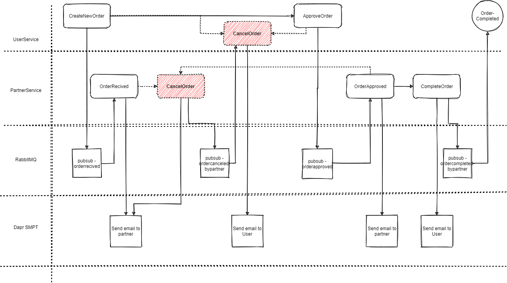
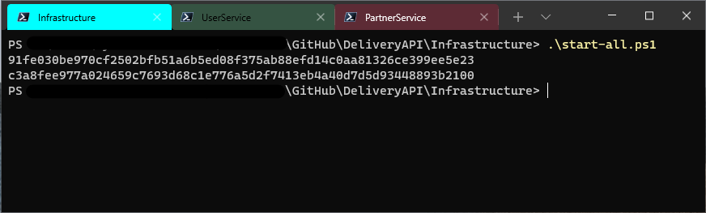
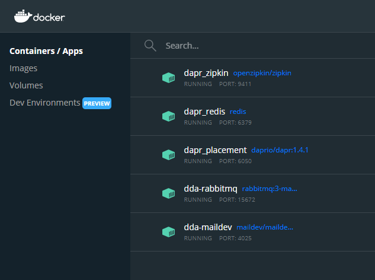
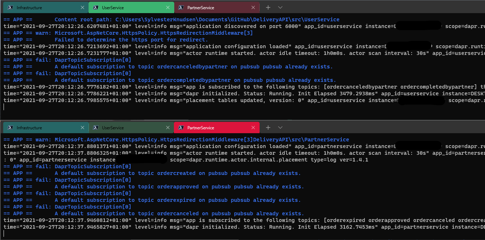
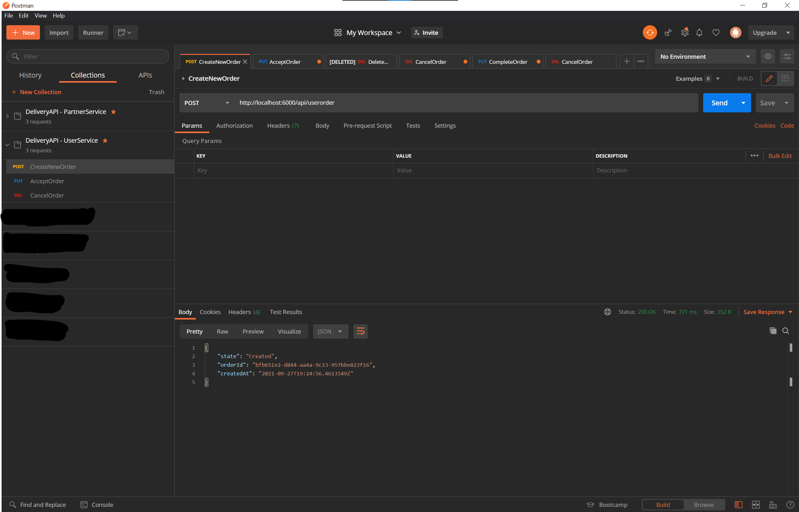
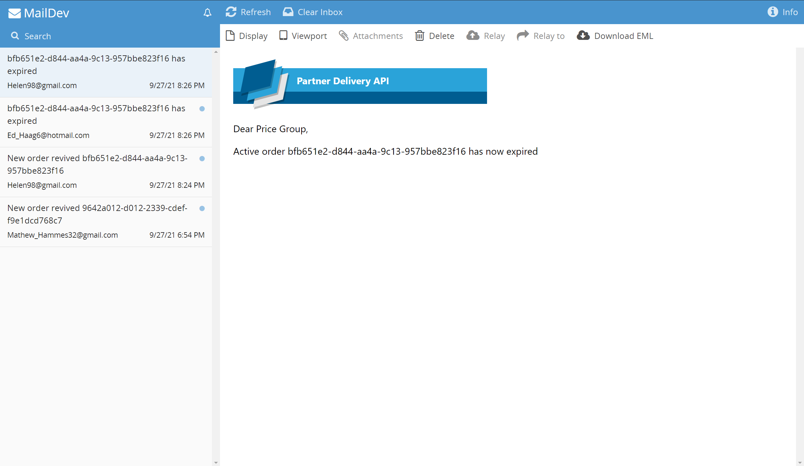

# DeliveryAPI

Sample repo containing two Asp.net web APIs that communicates using Dapr.

The sample contains a `UserService` from where users can create, approve and cancel delivery orders.
There is also a `PartnerService` from where partners can get, complete and cancel any active orders. 

There is currently no database associated with this sample, all data are created at runtime using the `BogusData` class found in the `UserService`. At runtime all orders created are stored in Daprs `statestore`. The two services publish and subscribes to messages using RabbitMQ as message broker. 

New orders will automatically expire if they have not been completed or canceled after 2 minutes. If an order expires an email is automatically sent to both user and partner. As the `OrderStateWatcher` lives in the user service, a messages is published to notify the PartnerService which order has expired. 

The two services uses `Dapr SMTP` for sending out emails to either the user or partner, to notify about changes that has happened to orders.

# How to run the sample
To run this sample we need to setup a couple of things, firstly we need to initialize [Dapr on our local environment](https://docs.dapr.io/getting-started/install-dapr-selfhost/).

After this we need to start RabbitMQ (pub/sub broker) and Maildev.
To do this open a terminal and change the current folder to `src/infrastructure`, from here execute `start-all.ps1`.

After the above is finished you should see `dda-rabbitmq` and `dda-maildev` containers in docker.

After the infrastructure has been started we need to start our services.

Open two new powershell instances and set the current folder to `src/UserService` in of them and `src/PartnerService` in the other. In both of the powershell instances run the `start-selfhosted.ps1`

After the script is finished you should see something similar to this:

Now everything should be setup and ready to use, you use the postman collections from this repo to test the APIs

To see the emails that are sent by the services, open a browser and browse to http://localhost:4000. You should see the emails coming in:

